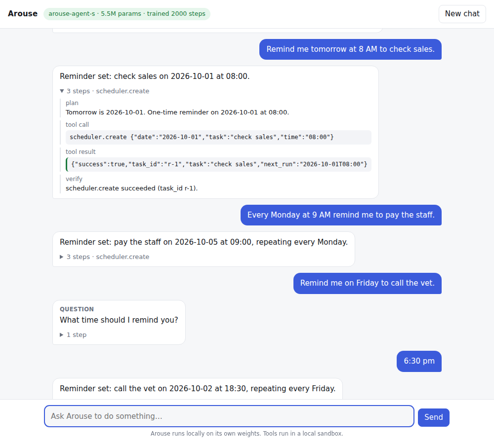
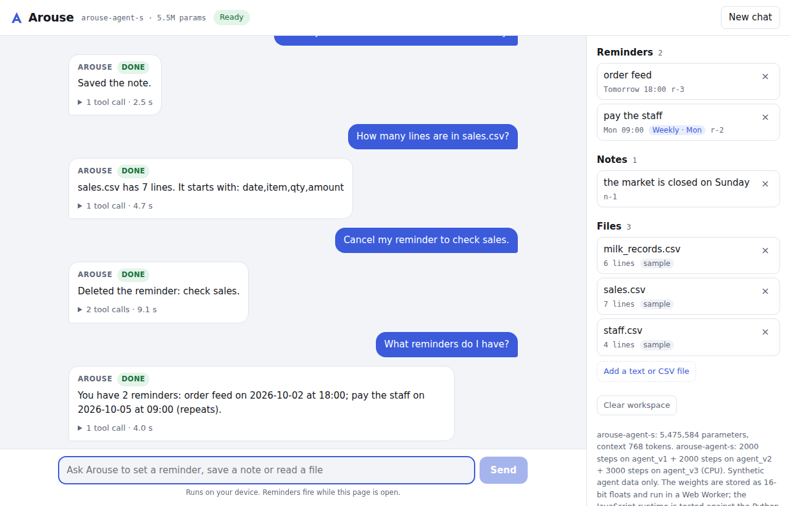

# Arouse AI

An independently trained language model for **reliable agentic task execution**: understand intent, plan, call tools with structured actions, observe the result, verify it, and then finish (or ask, or fail honestly).

- **Built from scratch:** own tokenizer, Transformer, training pipeline, weights, inference engine, agent runtime and benchmark.
- **Not a wrapper:** trained from random initialization. It is not a fine-tune of, or a proxy for, any external LLM.
- **Frameworks:** PyTorch is the only numerical framework. The API server uses the Python standard library.

```
USER / MDA → Arouse API → agent runtime → inference engine → Arouse model → structured action
                                  ↑                                              (tool_call | ask_user | finish | fail)
                          tools run here (sandbox, or MDA)
```

MDA (Modern Dairy Assistant) is a separate frontend. It connects through `POST /v1/agent` ([docs/api.md](docs/api.md)).



## Use it in your browser

`web/` is a static website that runs the trained model entirely in the browser, with no server-side model and no external AI service ([docs/web.md](docs/web.md)):

```bash
python -m http.server 8080 -d web      # open http://localhost:8080
```

- **Workspace:** reminders, notes and files live in the browser. Three sample files are included, and you can add your own text or CSV files.
- **Firing reminders:** reminders fire while the page is open.
- **GitHub Pages:** `.github/workflows/pages.yml` publishes the site (enable Pages with "GitHub Actions" as the source).
- **JS port:** the JavaScript runtime (`web/arouse.js`) is tested against the Python one: same token ids, same prompts, logits equal within float rounding, and identical decisions whenever no resampling is needed.



## Quick start (Python, local API)

```bash
pip install -e ".[dev]"
arouse serve --model models/arouse-agent-s        # open http://127.0.0.1:8000
arouse agent --model models/arouse-agent-s        # same agent in the terminal
```

Try messages like these:
- "Remind me tomorrow at 8 AM to check sales."
- "Every Monday at 9 AM remind me to pay the staff."
- "Remind me on Friday to call the vet." (it asks for the time)
- "What reminders do I have?"
- "Cancel my reminder to check sales."
- "Note that the feed delivery is late."
- "How many lines are in sales.csv?"

Tools run in a local in-memory sandbox. A real, unedited conversation is in [docs/demo_transcript.md](docs/demo_transcript.md).

## What Arouse can and cannot do (honest scope)

`models/arouse-agent-s` has **5.5M parameters** and was **trained on CPU** in this repo, about 86M tokens in total:
- 2,000 steps on `agent_v1`
- 2,000 steps on `agent_v2`
- 3,000 steps on `agent_v3`, which adds phrasing variety aimed at the measured weak spots

The training data is **synthetic agent episodes only**.

**It can:**
- create one-time, relative and recurring reminders (including follow-up questions for missing details)
- list and delete reminders
- save notes
- read and list files
- recover from tool errors
- handle greetings, thanks and help questions
- honestly refuse out-of-scope requests

**It cannot:**
- answer general-knowledge questions, write essays or code, or hold open conversation. It has never seen that kind of data. That requires the larger v0.1 model (110M), real pretraining text and a GPU.
- handle phrasing far from its training distribution reliably. The numbers below show how much this matters.

## Results (Arouse AgentBench v1, real runs)

`arouse bench`, full runs, with reports in `benchmarks/results/` (earlier runs in `benchmarks/results/history/`):
- **Held-out:** 1198 decisions from 400 episodes. Their tasks, notes, file names and sentence templates never appear in training.
- **In-distribution:** 456 decisions from 150 episodes. Same templates as training, but unseen samples.

Two modes are reported:
- **Raw:** the model alone (greedy decoding).
- **System:** the full runtime (constrained decoding, retries, grounding, guards).

| Metric | Held-out raw | Held-out system | In-dist raw | In-dist system |
|---|---|---|---|---|
| Decision accuracy (type + exact tool and arguments) | 65.36% | **93.24%** | 90.79% | **99.34%** |
| Structured-output validity | 91.07% | **98.66%** | 100.0% | **100.0%** |
| Action-type accuracy | 88.06% | **95.58%** | 99.56% | **99.56%** |
| Tool-selection accuracy | 83.83% | **92.86%** | 100.0% | **99.51%** |
| Argument exact match | 34.21% | **89.85%** | 80.49% | **99.02%** |
| Scheduling exact match | 18.45% | **92.56%** | 76.03% | **99.17%** |
| Asks when a detail is missing | 95.33% | **95.33%** | 100.0% | **100.0%** |
| False completion (finish after a tool error) | 0.0% | **0.0%** | 0.0% | **0.0%** |
| **End-to-end task success** (correct final action and correct resulting state) | — | **92.75%** | — | **98.0%** |

### What changed in this round (held-out, end to end)

| Category (n) | Previous release | Same model, new runtime | **New model + new runtime** |
|---|---|---|---|
| All episodes (400) | 71.25% | 85.0% | **92.75%** |
| Notes (27) | 22.22% | 100.0% | **100.0%** |
| Out-of-scope questions (15) | 40.0% | 40.0% | **100.0%** |
| Ambiguous requests (34) | 61.76% | 61.76% | **94.12%** |
| Answering a follow-up question (32) | 75.0% | 75.0% | **96.88%** |
| One-time reminders (69) | 57.97% | 86.96% | **91.3%** |
| File questions (40) | 67.5% | 100.0% | **100.0%** |
| Delete (28) | 32.14% | 35.71% | **42.86%** |
| Recurring reminders (66) | 98.48% | 98.48% | **96.97%** |
| Relative reminders (25) | 92.0% | 92.0% | **92.0%** |
| Listing, greetings, missing file | 100% | 100% | **100%** |

The middle column isolates the runtime changes; the difference to the last column is the extra training.

**Read these numbers with care:**
- **The held-out set is no longer fully blind for the runtime.** The new runtime rules were designed after inspecting held-out failures. The rules are general (no template strings), but they were motivated by this test set. The raw-model numbers are not affected.
- **Raw validity dropped:** the raw model's structured-output validity on held-out requests fell from 97.33% to 91.07%. The runtime recovers most of it (98.66%).
- **Still weak:** deletes with unseen phrasing ("Please drop the … reminder" is read as a new reminder). The runtime now refuses to delete a reminder the user did not name, so these fail safely instead of deleting the wrong one.
- **Small regressions:** recurring reminders lost one episode (98.48% → 96.97%). Error-recovery decisions went from 95.45% to 93.94% (one decision).

The gap between held-out and in-distribution numbers shows that a 5.5M model trained only on synthetic templates generalizes only partly to new phrasings. A larger model and real text are the next step.

## How reliability is engineered

| Layer | What it guarantees |
|---|---|
| Action protocol ([docs/protocol.md](docs/protocol.md)) | Exactly one schema-validated action per turn; a single token decides the action type |
| Token mask | The model cannot emit `<|user|>`, `<|tool_result|>` and similar tokens, so it cannot fake an observation |
| Copy-constrained decoding | The model still chooses which phrase or date:<br>• task and note text can only be copied from the user's words; notes are copied verbatim to the end of the sentence<br>• file paths must be whole file names the user wrote or a tool listed<br>• dates can only be ones the request refers to ("Friday", "tomorrow", "October 5", …) |
| Delete safety | A reminder is deleted only if it was listed and is the listed reminder that best matches the user's words. Otherwise Arouse fails without deleting anything |
| Answer guard | Final answers may only use Arouse's trained response vocabulary plus words from the conversation or tool results. A confirmation must state what the tool actually returned (otherwise it is written from the tool result), and "couldn't find" claims must agree with the listed reminders |
| Validation, retries, grounding | Invalid or ungrounded turns are resampled; otherwise the runtime returns an honest `fail` |
| Completion guard | A `finish` right after a failed tool call becomes `fail`. False "Done." messages never reach the user |
| Deterministic tools | "The model understands, code computes": the scheduler turns rules and offsets into times |

## Build it yourself

```bash
python scripts/build_agent_data.py --name agent_v1                           # synthetic episodes + AgentBench files
arouse tokenizer train --config configs/tokenizer_agent.yaml
arouse data prepare --config configs/data_agent.yaml
arouse train --config configs/train_agent_s.yaml                             # auto-resumes after a crash
python scripts/build_agent_data.py --name agent_v2 && arouse data prepare --config configs/data_agent_v2.yaml
arouse train --config configs/train_agent_s_v2.yaml                          # fine-tune (init_from)
python scripts/build_agent_data.py --name agent_v3 && arouse data prepare --config configs/data_agent_v3.yaml
arouse train --config configs/train_agent_s_v3.yaml                          # fine-tune from the v2 model
arouse model export --model checkpoints/arouse-agent-s-v3 --out models/arouse-agent-s
arouse bench --model models/arouse-agent-s --file benchmarks/agentbench_v1/test.jsonl
python scripts/export_web.py --model models/arouse-agent-s --out web/model   # float16 weights for the website
```

Notes:
- `train_agent_s.yaml` is the 4,000-step schedule; the shipped model used its step-2,000 checkpoint.
- The generator now produces the v3 data. The exact v1-phase data came from commit `246e0eb`.
- `models/arouse-agent-s/` contains the exact tokenizer the model was trained with.
- Rebuilding the data leaves `benchmarks/agentbench_v1/*.jsonl` alone unless you pass `--bench`. The held-out test split is frozen byte for byte (tested).

The 110M-parameter v0.1 configuration (`configs/model.yaml`, 110,119,680 params) uses the same code and needs a GPU.

## Milestones

All 7 are complete. See [docs/roadmap.md](docs/roadmap.md).

| # | Milestone | Docs |
|---|---|---|
| 1 | Tokenizer (byte-level BPE, 64 frozen special slots, agent tokens), config system | [docs/tokenizer.md](docs/tokenizer.md) |
| 2 | Transformer (RoPE, GQA, SwiGLU, RMSNorm, KV cache) | `arouse/model/` |
| 3 | Data pipeline (provenance, dedup, mixing, packing) + resumable training (bitwise-exact resume) | [docs/training.md](docs/training.md) |
| 4 | Action protocol + token codec + tool schemas | [docs/protocol.md](docs/protocol.md) |
| 5 | Inference engine + constrained decoding | `arouse/inference/`, `arouse/agent/constraints.py` |
| 6 | Agent runtime, sandbox tools, synthetic agent data, trained model | [docs/agent.md](docs/agent.md) |
| 7 | AgentBench + local API + chat UI | [docs/api.md](docs/api.md) |

## Layout

```
arouse/
  tokenizer/  model/  data/  training/  inference/
  protocol/   actions, tool schemas, token codec
  agent/      context (calendar), tools (sandbox), episode encoding, runtime, grounding, constraints, synth
  evaluation/ agentbench.py
  api/        server.py (stdlib HTTP), agent_service.py, static/index.html (chat UI)
web/          the website: arouse.js (JS port), worker.js, index.html, model/ (float16 weights, 11 MB)
configs/      model, tokenizer, data and training YAMLs
models/       arouse-agent-s (trained weights, 22 MB)
benchmarks/   agentbench_v1 cases + results/
datasets/     provenance manifests
docs/         design docs, demo transcript
tests/        pytest suite
```

## Tests

```bash
pytest -q
```

The suite includes:
- a Playwright browser test of the UI, which skips itself if Chromium isn't installed
- JS-vs-Python parity tests for the website, which skip themselves if Node isn't installed
